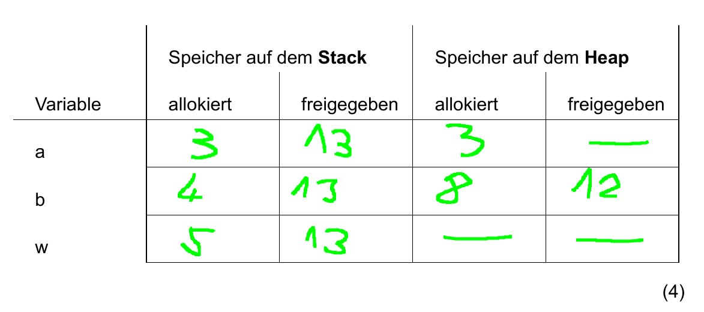

# Aufgaben 1 - Speicherverwaltung

## Aufgabe 1

### a)

Erledigt. VS Code als IDE und Clang 13.0.0 als Compiler.

### b)

Erledigt.

## Aufgabe 2

### a)

Ablauf einer Kompilierung:

1. Der Präprozessor verarbeitet die CPP-Quelldatei. Hierbei wird der Inhalt der Header Dateien in die Source Datei kopiert. Es resultiert eine erweiterte Quellcodedatei.
2. Die erweiterte Quellcodedatei wird vom Compiler in Assemblersprache für die jeweilige Plattform übersetzt. Es entsteht eine Assembler Datei (`.s` Datei).
3. Die Assembler Datei wird vom Assembler in eine Objekt-Code-Datei umgewandelt (`.o` Datei).
4. Die-Objekt-Code Datei wird mit Funktionen aus der Standardbibliothek kombiniert und mithilfe des Linkers zu einer ausführbaren Datei verlinkt.

### b)

Die Namen von Programmelementen wie Variablen, Funktionen, Klassen usw. müssen deklariert werden, bevor diese verwendet werden können.

Beispielsweise kann nicht einfach Dummy2 geschrieben werden, ohne `y` vorher zu deklarieren.
Die Deklaration teilt dem Compiler mit, ob das Element ein `int`, ein `double`, eine `class` oder ein anderes Element ist. Darüber hinaus muss jeder Name (direkt oder indirekt) in jeder CPP-Datei deklariert werden, in der er verwendet wird.

Wenn ein Programm kompiliert wird, wird jede CPP-Datei unabhängig in eine Kompilierungseinheit kompiliert.
Der Compiler weiß nicht, welche Namen in anderen Kompilierungseinheiten deklariert werden. Wenn also eine Klasse, Funktion oder globale Variable definiert wird, muss in jeder zusätzlichen CPP-Datei, die verwendet wird, eine Deklaration dieser Sache bereitstehen. Jede Deklaration dieser Sache muss in allen Dateien genau identisch sein. Eine geringfügige Inkonsistenz verursacht Fehler oder unbeabsichtigtes Verhalten, wenn der Linker versucht, alle Kompilierungseinheiten in einem einzigen Programm zusammenzuführen.

### c)

Einbindung von Headern:

1. Da in der Implementierung eventuell Klassen verwendet werden, die in den Headern definiert sind. Würden diese erstellt werden, ohne die Header einzubinden, würde ein Kompilierungsfehler entstehen, da der Compiler die Deklarationen nicht finden kann.
2. Eine Systembibliothek ist meistens eigenständig und kann direkt verwendet werden. Eigener Code verwendet eventuell Funktionen aus der Systembibliothek oder andere Fremdbibliotheken. Wenn Fremdbibliotheken im eigenen Code verwendet werden, sollten zuerst die Fremdbibliotheken eingebunden werden. Falls diese Bibliotheken Funktionen aus der Standardbibliothek verwenden, sollte diese zuerst eingebunden werden. Daher ergibt sich die Reihenfolge:

   Standardbibliothek > Fremdbibliotheken > eigene Header.

### d)

`#define` erstellt ein Makro, dass die angegebene Zeichenfolge mithilfe des Präprozessors durch die entsprechende Zeichenfolge ersetzt. Also wird bei `#define MULT(a, b) a * b` jedes `MULT(a, b)` durch `a * b` ersetzt.

#### 1)

```cpp
std::cout << MULT(2, 3) << std::endl;
```

wird zu:

```cpp
std::cout << 2 * 3 << std::endl. `6`;
```

Also ist die Ausgabe `6`.

#### 2)

```cpp
std::cout << MULT(2.f, 3.f) << std::endl;
```

wird zu:

```cpp
std::cout << 2.f * 3.f << std::endl;
```

Also ist die Ausgabe `6`.

#### 3)

```cpp
std::cout << MULT(1 + 4, 5 + 3) << std::endl;
```

wird zu:

```cpp
std::cout << 1 + 4 * 5 + 3 << std::endl;
```

Nach Punkt vor Strich ist die Ausgabe `24`.

#### 4)

```cpp
std::cout << MULT((1 + 4), (5 + 3)) << std::endl;
```

wird zu:

```cpp
std::cout << (1 + 4) * (5 + 3) << std::endl;
```

Also ist die Ausgabe `40`.

#### 5)

```cpp
std::cout << MULT("1" << 4, 5 << "2") << std::endl;
```

wird zu:

```cpp
std::cout << "1" << 4 * 5 << "2" << std::endl;
```

`1` wird ausgegeben, dann wird `4 * 5` berechnet und ausgegeben, dann wird `2` ausgegeben. Also ist die Ausgabe `1202`.

#### 6)

```cpp
std::cout << MULT(MULT(2, 3), 4) << std::endl;
```

wird zu:

```cpp
std::cout << 2 * 3 * 4 << std::endl;
```

Also ist die Ausgabe `24`.

## Aufgabe 3

### a)

#### Probleme:

- Variable a wird nie gelöscht → Speicherleck
- Wenn `w.exit()` 0 ist, wird b gelöscht, ohne jemals allokiert zu sein. Das müsste aber in C++ unproblematisch sein, da Pointer auf dem Stack automatisch zu `nullptr` initialisiert werden.
- Wenn das Programm in der While-Schleife abstürzt, wird der Speicher, auf den der Zeiger `b` zeigt, nicht gelöscht.
- Bei jeder Iteration der While-Schleife wird dem Zeiger `b` neuer Speicher zugewiesen. Das `delete` löscht nur den aktuellen `int` auf den `b` zeigt. Der alte zugewiesene Speicher wird nie gelöscht → Speicherleck

#### Tabelle:



### b)

- `p.candles` und `p.eyes` liegen auf dem Stack, `p.teeth` liegt im Heap, wegen des `new` Keyword.
- Der Integer mit dem Wert `32` ist `p.teeth` und liegt auf dem Heap.
- `p.teeth` wird zwar in Zeile 5 allokiert, aber nie freigegeben → Speicherleck.
- Was ändert sich?
  - `p.candles`, `p.eyes` und `p.teeth` liegen alle auf dem Heap.
  - Der Integer liegt immer noch im Heap.
  - Der Zeiger `p` weist Heap Speicher für eine `pumpkin`-Instanz zu, welcher allerdings nie freigegeben wird.

### c)

Aliasing beschreibt die Situation, wenn der gleiche Speicherbereich von Zeigern mit unterschiedlichem Namen angesprochen wird. Im Codebeispiel wird der Speicher an `f` von `ptr_f` und `ptr_i` referenziert. Ein Problem hier ist, dass in Zeile 5 die Speicheradresse auf den Float `f` in einen Zeiger vom Typ `int` gecastet wird. Das Problem dabei ist, dass ein `float` nicht den gleichen Speicher, wie ein `int` verbraucht. Daher zeigt `ptr_i` zwar auf den gleichen Speicher, ist allerdings ein Zeiger auf einen `int`. Aus diesem Grund entsteht unvorhersehbares Verhalten, wenn `ptr_i` dereferenziert wird.

## Aufgabe 4

### a)

#### Beispiel 1

Kompilierfehler Zeile 5.

Adresse von `p1` kann `p0` nicht zugewiesen werden, da `p1` schon ein Zeiger ist. Somit würde man versuchen auf die Adresse der Adresse des Ints zuzugreifen, was nicht funktioniert.

#### Beispiel 2

Korrekt.

Ausgabe: `Ergebnis: 5`

#### Beispiel 3

Korrekt.

Ausgabe: `0`

#### Beispiel 4

Korrekt.

#### Beispiel 5

Kompilierfehler Zeile 3.

`a` ist als `const int` deklariert, kann deshalb nicht verändert werden. Weist man nun die nicht-`const` Referenz `b` einer `const` Referenz `a` zu, würde man das `const` umgehen, was nicht möglich ist.

Ausgabe: `Ergebnis: 0x55555556aeb0`

#### Beispiel 6

Korrekt.

Ausgabe: `Ergebnis: 10 und 6`

#### Beispiel 7

Kompilierfehler Zeile 5.

Die Referenz `iref` ist eine Referenz auf den Wert von `i`, da `iref` in Zeile 4 als dereferenzierter `iptr` festgelegt ist. Daher ist die erneute Dereferenzierung in Zeile 5 ein Fehler und somit ungültig.

#### Beispiel 8

Kompilierfehler Zeile 3.

`iptrref` ist eine Referenz auf einen Zeiger, der auf einen `int` zeigt. `&i` also die Speicheradresse von `i` wird zu einem temporären Objekt. Eine nicht-`const` Referenz kann nicht an ein temporäres Objekt gebunden werden. Wäre die Referenz in diesem Fall `const`, würde der Code kompilieren, da die konstante Referenz den temporären Wert "am Leben erhält".

Zusammengefasst ist es in C++ nicht möglich ein temporäres Objekt an eine nicht-`const` Referenz zu binden.

#### Beispiel 9

Kompilierfehler Zeile 7.

Hier wird versucht eine read-only Variable zu verändern. Auf den ersten Blick ist `b` beschreibbar, da `b` nicht `const` ist. Allerdings ist die Referenz `pr` eine Referenz auf einen Zeiger, der auf einen `const int` zeigt. Der Zeiger an sich ist nicht `const` und kann daher verändert werden. Somit wird die Referenz `pr` in Zeile 6 auf die Adresse von `b` verändert. Da das Ziel auf das der Zeiger der Referenz zeigt, allerdings in Zeile 5 als `const` deklariert wurde, kann `*pr` und somit `b` nicht verändert werden.

#### Beispiel 10

Kompilierfehler Zeile 4.

Da hier der Zeiger `p` selbst als `const` deklariert wurde, kann dieser, auch wenn das Ziel in Zeile 3 gelöscht wird, nicht mehr geändert werden. Es wird versucht in Zeile 4 einen `const` Wert zu ändern, was nicht möglich ist.

#### Beispiel 11

Kompilierfehler Zeile 7.

In Zeile 7 wird versucht `jptr` zu ändern. Das ist nicht möglich, da dieser in Zeile 5 als `const` deklariert wurde.

#### Beispiel 12

Korrekt.

Ausgabe: `TRUE`

### b)

#### Generell

Ein Problem, das entstehen kann, wenn Referenzen als Rückgabetyp verwendet worden ist, dass wenn in der Funktion eine Allokation stattfindet, der Aufrufer der Funktion daran denken muss den Speicher am Ziel der Referenz freizugeben.

Für nicht optionale Parameter eignet es sich eine Referenz bzw. eine konstante Referenz zu verwenden, da diese nie `NULL` sein können und man sich eine Überprüfung auf `NULL` spart.

Referenzen sollten verwendet werden, wenn variablen beim Aufrufer verändert werden sollen und konstante Referenzen sollten verwendet werden, wenn der Typ kein eingebauter Typ ist und nicht beim Aufrufer bearbeitet wird.

#### Code Beispiel

Im Code wird nach dem Freigeben von `meat` der Wert auf den `meat` zeigt weiter verwendet (use-after-free). Also gibt die Funktion einen Wert zurück auf den `meat` aktuell zeigt, was prinzipiell alles sein kann. Auch wenn die Funktion keinen `nullptr` zurückgeben kann, kann sie dennoch unerwartetes Verhalten produzieren.

In diesem Fall wäre die Rückgabe eines `nullptr`s eindeutiger für den Aufrufer.

### c)

#### A

Sollte als konstante Referenz übergeben werden, da der Pfad in der Funktion wahrscheinlich nicht geändert wird und eine Referenz nicht `NULL` sein kann.

```cpp
image image::load(const string& path);
```

#### B

`source` ist konstante Referenz, da diese nicht bearbeitet wird. `dest` ist eine Referenz, da der Parameter nicht optional ist. `size` wird auch nicht verändert, deshalb konstante Referenz.

```cpp
void memory_copy(const char& source, char& dest, const size_t& size);
```

#### C

`result` ist eine Referenz, da der Parameter nicht optional ist und den Wert des Parameters beim Aufrufer ändert. `other` ist eine konstante Referenz, da die Kugel beim Überprüfen auf Schnittpunkte nicht verändert werden muss.

```cpp
void sphere::does_intersect(const sphere& other, bool& result);
```

#### D

`size_x` und `size_y` werden als Kopie übergeben, da sie ein eingebauter Typ sind. Der Aufrufer soll `size_x` und `size_y` auch nicht verändern. `color` soll nicht verändert werden, ist allerdings kein eingebauter Typ, deshalb als Referenz.

```cpp
image::image(int size_x, int size_y, color &data);
```

#### E

`count` soll nicht verändert werden und ist ein eingebauter Typ, daher Kopie. `elements` soll nicht beim Aufrufer verändert werden und ist nicht optional, daher konstante Referenz.

```cpp
array::array(int count, const element& elements);
```

#### F

`image` ist ein nicht-`const` Zeiger, da das Image optional verändert wird. `bool` ist eingebaut, daher Kopie. `scene` ist nicht eingebaut, soll nicht beim Aufrufer verändert werden und ist nicht optional, daher konstante Referenz.

```cpp
void renderer::execute (const scene& s, image* screenshot, bool make_screenshot);
```
